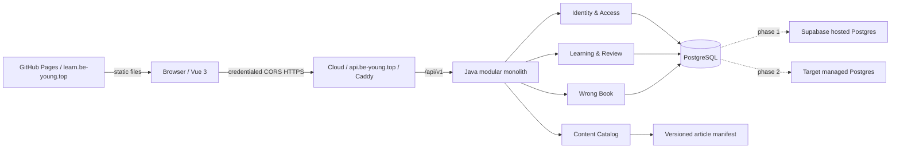

# Java 后端、部署与数据库迁移方案

## 1. 结论

推荐建设一个 **Java 模块化单体**，先把浏览器对 Supabase 的直接访问迁移到 `/api/v1`，稳定运行一段时间后再迁移 PostgreSQL。不要在同一次上线中同时更换认证方式、业务接口和数据库，也不需要为当前体量引入微服务、消息队列或 Kubernetes。

迁移期间保持两个清晰环境：

- `main` 继续承载现有 GitHub Pages 生产版本，不改变当前部署行为。
- `codex/java-backend-migration` 作为隔离集成分支；新后端和 API 版前端只部署到 staging。

当前 GitHub Actions 只监听 `main`，所以开发分支不会误触发现有 Pages 发布。

## 2. 现状审计

| 方面 | 代码中的现状 | 对迁移的影响 |
| --- | --- | --- |
| 前端 | Vue 3.4、Vite 5、Pinia、Vue Router，JavaScript 项目 | 可以保留，不需要为了 Java 后端改写为另一套前端框架 |
| 内容 | Markdown 文件是内容源，构建前生成 `articles.json` 和 `id_map.json` | 内容暂不入库；必须把文章 ID 当作稳定业务身份 |
| 数据访问 | 33 个 `src` 文件中有 9 个直接访问 Supabase，共引用 4 张表 | 先建立前端数据 seam，再逐个业务切片切换到 HTTP |
| 身份 | 仅按用户名查询 `student`；没有密码或 Supabase Auth 会话 | 当前“登录”不能证明身份，必须由后端优先接管 |
| 管理员 | `young` 在前端被硬编码为超级用户；输入三次 `+` 可进入管理页 | 管理能力必须由服务端角色校验，不能只隐藏入口 |
| 路由 | 所有 `requiresAuth` 守卫被注释，最终无条件放行 | 路由守卫只能改善体验，真正授权必须在后端完成 |
| 数据模型 | `student.permissions` 是 `int[]`；`wrong_questions.student_id` 在代码中按字符串处理；题目标识有数值/文本混用 | 需要先确认生产库真实类型，再做可回滚的规范化 |
| 数据库资产 | 仓库没有 Supabase CLI 配置、DDL、migration 或 RLS policy | 在写第一条 Flyway migration 前，必须先导出生产 schema、policy、trigger、index 和 extension |
| 测试 | package scripts 只有开发、构建和预览，没有单元/E2E 测试入口 | API 替换必须先增加契约、后端集成和关键用户旅程测试 |
| 部署 | `main` 构建后发布到 GitHub Pages，浏览器注入 Supabase URL/anon key | 新版本改为只注入 API base URL；数据库凭据永远只在服务端 |

目前能从代码确认的表和字段如下；它们只是审计线索，不应替代生产 schema dump。

| 当前表 | 已观察到的字段/约束 |
| --- | --- |
| `student` | `id`, `username`, `permissions`; 用户名应唯一 |
| `article_answer_keys` | `blog_id`, `question_id`, `answer_text`, `auto_grade`, `updated_at`; 代码假定 `(blog_id, question_id)` 唯一 |
| `article_question_submissions` | `blog_id`, `student_id`, `question_id`, `answer_text`, `review_status`, `review_result`, `submitted_at`, `reviewed_at`; 代码假定三列组合唯一 |
| `wrong_questions` | `id`, `student_id`, `source_blog_id`, `source_question_id`, `my_answer`, `is_manual`, `wrong_count`, `wrong_reason`, `note`, `mastered`, `removed`, `updated_at`; 代码假定来源三列组合唯一 |

## 3. 目标架构



最终生产环境保留 GitHub Pages 托管 Vue，但为它配置 `learn.be-young.top`，云端 API 使用
`api.be-young.top`。两者是不同 origin、相同 site，可以继续使用 API host-only 的
`HttpOnly + Secure + SameSite=Lax` 服务端会话；前端通过精确 CORS 白名单和
`credentials: 'include'` 调用 API，长期凭据仍不进入 `localStorage`。

不推荐用默认 `*.github.io` 地址直接调用独立 API 域名。该组合是 cross-site，cookie 需要
`SameSite=None; Secure`，并可能被浏览器第三方 cookie 策略拦截；若必须保留默认地址，需要单独重做为
token/PKCE 认证方案，不属于“其他计划不变”的路径。

## 4. 推荐技术栈

以下版本是 2026-08 启动项目时的基线；真正生成骨架时应再核对一次兼容矩阵并由 Maven dependency management 锁定。

| 层面 | 推荐 | 原因 |
| --- | --- | --- |
| 运行时 | Java 21 LTS | 与当前开发工具链一致、生态成熟且仍有长期支持；不使用预览特性，后续可独立升级 |
| Web 框架 | Spring Boot 4.1 + Spring MVC | 当前业务是阻塞式 PostgreSQL I/O，MVC 比 WebFlux 更直接 |
| 安全 | Spring Security、服务端 opaque session、Argon2id 密码哈希、CSRF 防护 | 会话可撤销，敏感 token 不进入浏览器持久存储 |
| 数据访问 | Spring JDBC `JdbcClient`/少量 Spring Data JDBC | 当前模型小且 SQL 明确，避免 JPA lazy loading 和过度实体映射 |
| 数据迁移 | Flyway + PostgreSQL 原生 SQL | schema 进入 Git，支持可审计、可重复的顺序迁移 |
| 接口 | REST JSON `/api/v1` + OpenAPI 3 | Vue 集成直接，任务型 endpoint 比暴露表 CRUD 更稳定 |
| 校验/错误 | Jakarta Validation + RFC 9457 Problem Details | 保持错误结构一致，前端不解析数据库错误文本 |
| 测试 | JUnit 5、AssertJ、MockMvc、Testcontainers PostgreSQL | 以真实 PostgreSQL 行为验证 transaction、constraint 和 migration |
| 前端测试 | Vitest + Playwright | 覆盖 gateway contract 和登录/答题/批阅/错题关键旅程 |
| 可观测性 | Spring Boot Actuator、Micrometer、结构化日志 | 首期暴露 health/readiness；指标系统可按需要接 Prometheus/OTLP |
| 构建 | Maven Wrapper、分层 Docker image | 版本统一，CI 和服务器不依赖预装 Maven |
| 边缘与 TLS | Caddy（默认）或现有团队熟悉的 Nginx | 单机部署、HTTPS 和反向代理足够；无需 Kubernetes ingress |
| 交付 | GitHub Actions + GHCR + Docker Compose | 与当前 GitHub 工作流连续，适合单台或少量云服务器 |

不建议首期加入 Redis、Kafka、Elasticsearch、GraphQL 或微服务。只有出现第二个应用实例、明确的异步吞吐问题或搜索需求时，再用数据说明是否引入。

## 5. 后端模块与 interface

后端使用按业务能力分包的模块化单体，而不是全局 `controller/service/repository/entity` 四层目录。每个模块的外部 interface 同时是 controller 和测试使用的 surface，事务、授权和数据 adapter 留在 module implementation 内。

| Module | 小而稳定的 interface | 隐藏在 implementation 内的行为 |
| --- | --- | --- |
| Identity | 激活账户、登录、退出、查询当前账户 | 密码哈希、失败次数、会话轮换、角色映射、审计 |
| Learning Access | 查询可见文章、授予/撤销内容访问 | 管理员绕过规则、目录校验、批量授权、事务 |
| Learning & Review | 加载文章作答状态、保存作答、维护参考答案、批阅 | 自动批阅、状态转换、唯一约束、时间戳和错题收集联动 |
| Wrong Book | 列表、收集、编辑、标记掌握、移除 | 手动/自动来源、软删除复活、错误次数累加、幂等性 |
| Content Catalog | 按 ID 查询文章、同步版本化目录 | manifest 解析、ID 稳定性检查、已删除内容的保留策略 |

建议的仓库目标结构：

```text
/
|- tutor-nest-vue/                 # 保留现有前端
|- backend/
|  |- pom.xml
|  |- .mvn/ + mvnw + mvnw.cmd
|  |- api/openapi.yaml
|  `- src/
|     |- main/java/.../identity/
|     |- main/java/.../access/
|     |- main/java/.../learning/
|     |- main/java/.../wrongbook/
|     |- main/java/.../catalog/
|     `- main/resources/db/migration/
|- deploy/
|  |- compose.yaml
|  |- Caddyfile                      # 只代理云端 API 和 TLS
|  `- scripts/
|- docs/
`- CONTEXT.md
```

### 前端迁移 seam

迁移期只建立四个按能力划分的 gateway：`identityGateway`、`learningGateway`、`adminGateway`、`wrongBookGateway`。staging 使用 HTTP adapter，现有生产构建继续使用 Supabase adapter；这时两个 adapter 都真实存在，seam 有价值。

完成切换后删除 Supabase adapter 和 `src/utils/supabase.js`。届时不要保留一套只把方法逐层转发给 HTTP client 的空壳；页面/Pinia store 应调用每个能力模块的少量任务型方法。

## 6. 身份迁移方案

当前用户名登录不能验证身份，也没有可安全自动迁移的密码。因此不能把现有 localStorage 会话升级成可信会话。

推荐流程：

1. 为每条现有 `student` 数据创建待激活账户，保留原数字 ID 和用户名。
2. 管理员生成一次性激活码并线下交给对应学习者；学习者首次进入新站点时设置密码。
3. 密码只保存 Argon2id hash；激活码同样只保存 hash，且设置有效期和单次使用标记。
4. 把 `young` 迁移为数据库中的真实 `ADMINISTRATOR` 角色，删除特殊用户名和前端全权限逻辑。
5. 默认采用邀请制注册。若未来开放自注册，再单独增加用户名占用、滥用防护和账户恢复流程。
6. 所有管理 endpoint 在后端校验角色；所有学习 endpoint 从会话取得 learner ID，忽略浏览器提交的其他 student ID。

若学习者数量很少，也可以由管理员直接重置临时密码，但必须要求首次登录改密；不要迁移一个共享密码，也不要继续允许“只输入用户名”。

## 7. 目标数据模型

迁移后的推荐模型如下。名称可在导出真实 schema 后微调，但关系和身份语义应保持。

| 目标关系 | 关键约束与迁移说明 |
| --- | --- |
| `account` | 保留现有数字 ID；`username` 大小写规则明确且唯一；包含 password hash、role、status、审计时间 |
| `learning_article` | ID 来自版本化 `id_map`; path/title 是属性；被引用的旧文章默认归档而非硬删 |
| `content_grant` | `(learner_id, article_id)` 唯一，替代 `permissions int[]`；两端都有外键和索引 |
| `answer_key` | `(article_id, question_key)` 唯一；`question_key` 使用 text |
| `submission` | `(learner_id, article_id, question_key)` 唯一，表示当前作答；状态与结果有 check constraint |
| `wrong_question_entry` | 自动来源三元组唯一；手动来源策略在真实数据确认后固定；计数不小于 1 |
| `web_session` | 由 Spring Session JDBC 管理；过期会话可清理 |
| `account_activation` | 激活码 hash、过期时间、使用时间；不保存明文码 |

不要在第一批 migration 中直接 rename/drop 当前表。先创建新关系、回填、验证、切换读写，经过回滚窗口后再 contract。

## 8. 数据库迁移步骤

### M0：建立可验证的源数据基线

- 使用 Supabase CLI/`pg_dump` 导出 schema-only、roles/policies 和 data dump；记录 PostgreSQL 大版本。
- 盘点 `public` schema 以外的 extension、function、trigger、sequence、RLS policy 和 privilege。
- 对四张业务表记录行数、主键范围、组合键重复、空值、孤儿引用和字段实际类型。
- 把 schema 纳入 `supabase/migrations` 或 Flyway baseline；从此不再用 Dashboard 直接改生产表。
- 从备份恢复到隔离 staging，并实际启动现有前端验证；没有恢复演练的备份不算可用备份。

**Gate:** 能从仓库 migration + 受控备份重建一个与生产结构一致的 staging 数据库。

### M1：只做 additive schema

- 新增账户激活、角色和服务端会话需要的表/列。
- 新增 `learning_article` 和 `content_grant`，从 `id_map.json` 与 `student.permissions` 幂等回填。
- 给当前组合键补唯一约束前，先报告并修复重复数据。
- 所有新列先允许兼容旧版本的空值或默认值；migration 设定合理 `lock_timeout`。

**Gate:** 当前 GitHub Pages 生产版本在新 schema 上仍可正常使用。

### M2：后端连接现有 Supabase PostgreSQL

- 长驻云服务器优先使用 Supabase direct connection；若服务器只有 IPv4，则使用 Supavisor session mode。
- 应用使用专用、最小权限数据库角色和小型 HikariCP pool；migration 使用独立高权限凭据。
- Flyway 只能由一次性 release job 执行，多个应用副本不能并发抢跑 migration。
- 实现模块 interface、OpenAPI contract、集成测试和审计日志，不改变生产前端。

**Gate:** staging 全部关键旅程通过，且 API 对源数据的读结果与旧前端一致。

### M3：按垂直切片切换前端

推荐顺序：

1. Identity：激活、登录、退出、当前账户。
2. Learning Access：可见文章和管理员授权。
3. Learning & Review：参考答案、作答、自动批阅、人工批阅。
4. Wrong Book：查询、收集、更新、软/硬删除语义。

每个切片先在 staging 使用 HTTP adapter 跑契约测试和 Playwright，再切下一片。生产环境不要由浏览器双写 Supabase 和 API；若过渡期必须同步，只允许数据库内单点 trigger/transaction，并明确删除日期。

**Gate:** 新前端构建不包含 Supabase SDK/anon key，九个直接数据库访问文件全部迁移，服务端覆盖所有授权判断。

### M4：应用层生产切换，数据库仍留在 Supabase

- 先把新 Vue build 部署到 staging Pages/custom domain，把 Java API 部署到 staging API 子域名。
- 验证 credentialed CORS preflight、session cookie、CSRF、登录和退出；允许 origin 必须是精确值。
- 生产切换前降低 DNS TTL，生成最终备份并冻结 schema 变更。
- 发布 GitHub Pages 前端和云端 API，健康检查和 smoke test 通过后再开放登录。
- 稳定期后撤销 `anon` 对业务表的直接写权限，并验证 RLS/privilege 不允许旧浏览器绕过 API。
- 保留旧 GitHub Pages artifact 和回滚说明，但不再让它写生产数据。

**Gate:** 至少覆盖登录、文章授权、提交、批阅、错题复活、管理员越权拒绝和会话过期的生产 smoke/监控。

### M5：contract schema

- 后端读写已切到规范化关系后，停止写 `student.permissions` 等旧结构。
- 经过约定回滚窗口，再 drop 旧列/旧表或改为只读兼容 view。
- 清理迁移期 trigger、adapter 和 feature flag。

**Gate:** 代码扫描无旧表名，备份恢复和 Flyway 从零迁移都通过。

### M6：物理迁移到目标 PostgreSQL

应用层已稳定后再迁库：

1. 在目标托管 PostgreSQL 上用 staging dump 完整演练，目标大版本与源相同或先确认兼容，不在切库窗口顺便做大版本升级。
2. 对轻量平台优先选择短维护窗口：禁止写入，执行最终 custom-format dump/restore，运行 Flyway validate 和数据校验。
3. 只修改 Java 服务端 `DATABASE_URL`/凭据；前端和 HTTP contract 不变。
4. 先保持维护模式执行登录、查询、提交事务、批阅和错题 smoke test；通过后才开放写入。
5. Supabase 保持只读一段回滚窗口。开放新库写入后若要回滚，必须先反向同步新增数据，不能只把 DNS 指回去。
6. 数据量或停机要求将来显著增长时，再评估逻辑复制；当前不先承担双主和增量同步复杂度。

**Gate:** 表行数、业务不变量、抽样 checksum、sequence 当前值、时区、账号权限和关键旅程全部一致。

## 9. 数据校验清单

每次回填和 restore 至少输出机器可保存的报告：

- 每张表总行数、按 learner 分组的 submission/错题数量。
- `permissions int[]` 展开数与 `content_grant` 行数对比。
- 组合唯一键的重复数必须为 0。
- submission、answer key、wrong entry 指向不存在文章/账户的孤儿数。
- `wrong_count >= 1`，review state/result 合法组合，时间戳统一为 UTC。
- ID/sequence 最大值，避免恢复后插入主键冲突。
- 对稳定排序后的关键列做抽样或分桶 checksum，而不是只看总行数。
- 真实角色矩阵：学习者不能读他人作答，管理员可以管理但所有操作留审计记录。

## 10. API 轮廓

接口以任务为中心，不暴露通用 `/table/{name}` CRUD：

```text
POST   /api/v1/account-activations/complete
POST   /api/v1/sessions
DELETE /api/v1/session
GET    /api/v1/session

GET    /api/v1/articles
GET    /api/v1/articles/{articleId}/study-state
PUT    /api/v1/articles/{articleId}/submissions/{questionKey}

GET    /api/v1/wrong-book
POST   /api/v1/wrong-book/entries
PATCH  /api/v1/wrong-book/entries/{entryId}
DELETE /api/v1/wrong-book/entries/{entryId}

GET    /api/v1/admin/learners
PUT    /api/v1/admin/learners/{learnerId}/content-grants
PUT    /api/v1/admin/articles/{articleId}/answer-keys/{questionKey}
PUT    /api/v1/admin/submissions/{submissionId}/review
```

自动批阅与错题收集应在同一个后端 transaction 中完成。所有写接口定义幂等或并发策略：submission 使用版本号/`If-Match` 或明确 last-write-wins；错题自动收集依靠唯一键原子 upsert，不能先查再写形成竞态。

## 11. CI/CD 与云端部署

### Pipeline

1. PR：前端 lint/test/build，后端 `mvn verify`，Testcontainers migration/integration test，OpenAPI breaking-change 检查。
2. 合入开发分支：构建不可变 image，使用 commit SHA 标记并推送 GHCR，部署 staging，运行 smoke test。
3. 发布生产：GitHub Environment 人工批准；先运行一次 migration job，再滚动/替换 app，等待 `/actuator/health/readiness`。
4. 失败：migration 尚未执行时回滚 image；只允许 backward-compatible migration 自动上线，破坏性 contract migration 单独审批。

### 推荐生产拓扑

- GitHub Pages 继续托管 Vue build，并绑定 `learn.be-young.top`；构建时只注入
  `VITE_API_BASE_URL=https://api.be-young.top/api/v1`。
- 一台小型云主机运行 Caddy 和 Java container，对外提供 `api.be-young.top`。
- PostgreSQL 优先使用同区域托管服务；它比“同机数据库”更容易获得备份、监控和故障恢复。
- 若预算必须同机运行 PostgreSQL：独立 volume、数据库端口不暴露公网、每日加密备份到异机/对象存储、定期恢复演练，并监控磁盘空间。
- 防火墙只开放 80/443 和受限管理入口；SSH 禁止密码登录。
- secrets 放服务器受限 env/secret 文件和 GitHub Environment，不进入 image、Compose 文件或 `VITE_*`。
- 日志默认输出 stdout，由容器日志轮转；健康端点只公开 `health`，其他 Actuator endpoint 走内网或管理员认证。

### 备份目标

- 明确 RPO/RTO 后再选策略。轻量平台最低基线：每日全量、保留 7/30 日层级、异地一份、每月恢复演练。
- 托管数据库启用 PITR 时仍需验证恢复过程；PITR 不是 schema migration 的替代品。
- 文章 Markdown、`id_map.json` 和 Flyway migration 已在 Git，但数据库数据和上传资产仍需独立备份。

## 12. 安全上线门槛

- 删除特殊用户名管理员逻辑和“按用户名即登录”。
- 服务端逐 endpoint 校验账户状态、角色、内容授权和资源所有权。
- cookie 设置 `HttpOnly`, `Secure`, `SameSite=Lax`；登录后和提权后轮换 session ID。
- 保持 CSRF 防护；CORS 只允许 GitHub Pages 的精确生产/staging origin，credentialed CORS 禁止 `*`。
- 登录/激活做速率限制和统一错误提示，避免枚举用户名。
- 数据库应用角色不能创建 schema、修改 role 或读取不需要的 auth secret。
- 前端不包含数据库 URL/key；Supabase anon role 在切换后无业务表写权限。
- 管理操作、登录失败、权限变更和批阅写入可追踪审计日志，但日志不记录密码、激活码、cookie 或完整答案正文。

## 13. 实施阶段与验收产物

| 阶段 | 主要产物 | 完成定义 |
| --- | --- | --- |
| A. 基线 | schema dump、数据质量报告、staging restore、测试清单 | 可重建当前数据库且旧前端可用 |
| B. 骨架 | `backend/`、模块包、security、Flyway、Testcontainers、OpenAPI、CI | 空业务服务可部署并通过 readiness |
| C. Identity/Access | 激活与登录、真实管理员角色、授权 API | 越权测试通过，旧 magic admin 删除于新构建 |
| D. Learning/Review | 作答、答案、自动/人工批阅 API | 事务和并发测试通过，与旧数据结果对账 |
| E. Wrong Book | 错题全流程 API | 自动收集幂等，软删除复活语义通过 |
| F. 应用切换 | API 版 Vue、同域部署、Supabase 浏览器权限撤销 | 浏览器网络请求中没有 Data API 调用 |
| G. Schema 收口 | 规范化 schema、旧结构清理 | 从零 migration 与备份恢复均通过 |
| H. 迁库 | 目标 PostgreSQL、切库/回滚 runbook、监控与备份 | 维护窗口演练与生产校验通过 |

## 14. 开工前仍需确认的信息

这些信息会影响配置和工期，但不阻塞当前架构选择：

- Supabase 实际 schema dump、RLS/privilege、PostgreSQL 版本和四张表数据量。
- 当前学习者数量，以及能否逐人发放激活码。
- 目标云厂商/区域、是否有托管 PostgreSQL、是否已有域名和 HTTPS。
- 可接受维护窗口、期望 RPO/RTO、月度预算。
- 是否必须继续允许公开注册，还是改为管理员邀请。

## 15. 官方依据

- Spring Boot 4.1 支持 Java 17–26，并提供 Actuator、Micrometer 和容器化能力：<https://docs.spring.io/spring-boot/system-requirements.html>
- Spring Security Resource Server 可在未来需要时验证标准 JWT，但本项目同站跨域拓扑仍首选可撤销的服务端会话：<https://docs.spring.io/spring-security/reference/servlet/oauth2/resource-server/jwt.html>
- GitHub Pages 支持自定义子域名：<https://docs.github.com/en/pages/configuring-a-custom-domain-for-your-github-pages-site>
- Spring Security 要求 CORS preflight 在认证过滤之前处理：<https://docs.spring.io/spring-security/reference/7.0/servlet/integrations/cors.html>
- Supabase 对长驻 VM 推荐 direct connection，IPv4-only 持久后端可用 Supavisor session mode：<https://supabase.com/docs/guides/database/connecting-to-postgres>
- Supabase 建议把 migration 保存在仓库并通过 CI 部署，不再直接修改远端数据库：<https://supabase.com/docs/guides/deployment/database-migrations>
- Flyway 的 PostgreSQL 支持可执行原生 SQL 和 `pg_dump` 风格脚本：<https://documentation.red-gate.com/flyway/reference/database-driver-reference/postgresql-database>
